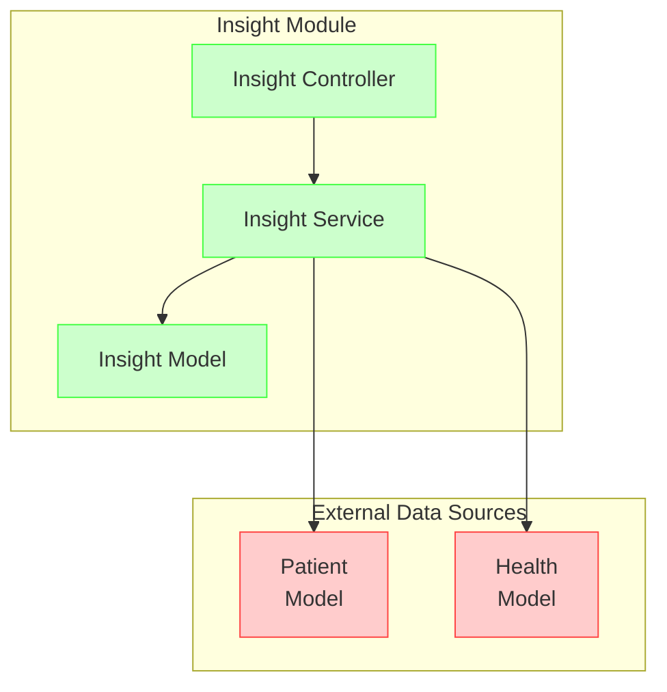
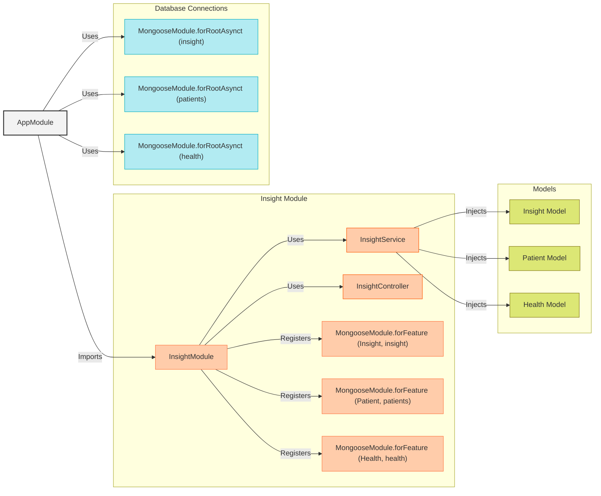
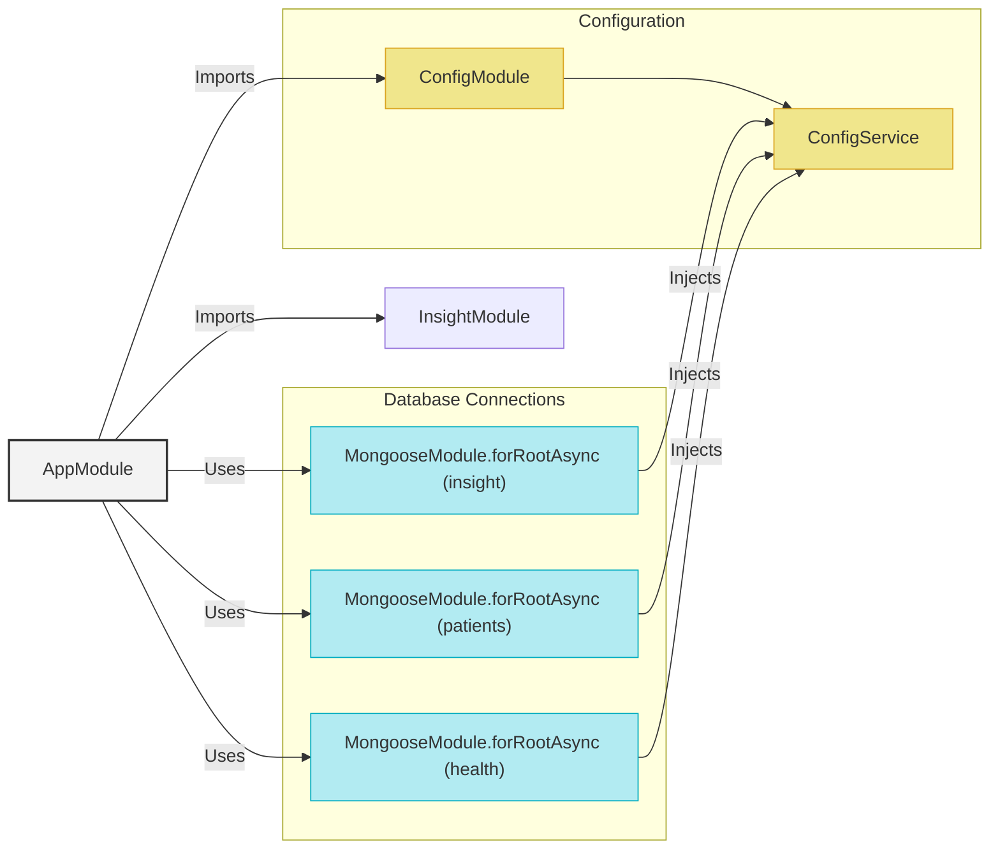

# Aggregating Data from Multiple Databases in a NestJS Insight Service
When developing an insight service in NestJS that requires aggregating data from multiple databases, it is crucial to understand how to effectively manage connections to different MongoDB databases and perform operations across them.

Full article can be found [https://kelvinbz.medium.com/exploring-a-nestjs-application-with-mongodb-using-mongoose-a-beginners-guide-multiple-database-dcb55dff1c90](https://kelvinbz.medium.com/exploring-a-nestjs-application-with-mongodb-using-mongoose-a-beginners-guide-multiple-database-dcb55dff1c90)
## Scenario: Aggregating Health Insights



## Component Interaction Diagram


## Configuring the App Module

The `AppModule` uses MongooseModule.forRootAsync to asynchronously configure and establish connections to three different MongoDB databases: insight, patients, and health



```typescript
import { Module } from '@nestjs/common';
import { ConfigModule, ConfigService } from '@nestjs/config';
import { MongooseModule } from '@nestjs/mongoose';
import { InsightModule } from './insight/insight.module';
import databaseConfig, { CONFIG_DATABASE } from './config/database.config';

@Module({
  imports: [
    ConfigModule.forRoot({
      load: [databaseConfig],
      envFilePath: '.env',
      isGlobal: true,
    }),
    MongooseModule.forRootAsync({
      imports: [ConfigModule],
      connectionName: 'insight',
      useFactory: async (configService: ConfigService) => {
        return {
          uri: configService.get(CONFIG_DATABASE).insight.uri,
        };
      },
      inject: [ConfigService],
    }),
    MongooseModule.forRootAsync({
      imports: [ConfigModule],
      connectionName: 'patients',
      useFactory: async (configService: ConfigService) => {
        return {
          uri: configService.get(CONFIG_DATABASE).patients.uri,
        };
      },
      inject: [ConfigService],
    }),
    MongooseModule.forRootAsync({
      imports: [ConfigModule],
      connectionName: 'health',
      useFactory: async (configService: ConfigService) => {
        return {
          uri: configService.get(CONFIG_DATABASE).health.uri,
        };
      },
      inject: [ConfigService],
    }),
    InsightModule,
  ],
})
export class AppModule {}

```
- MongooseModule.forRootAsync is used to asynchronously configure the connection to MongoDB. This is done for each of the three databases (insight, patients, and health).
- useFactory: This is a factory function that retrieves the database URI from the configuration service (ConfigService).

Please note that you shouldn't have multiple connections without a name, or with the same name, otherwise they will get overridden.

## Insight Module


The InsightModule is responsible for managing the Insight, Patient, and Health entities. It imports the necessary Mongoose schemas and registers them with their respective database connections. This module also provides the InsightService and InsightController to handle business logic and HTTP requests related to insights.
```typescript
// src/insight/insight.module.ts
import { Module } from '@nestjs/common';
import { MongooseModule } from '@nestjs/mongoose';
import { InsightService } from './insight.service';
import { InsightController } from './insight.controller';
import { Insight, InsightSchema } from './schemas/insight.schema';
import { Patient, PatientSchema } from './schemas/patient.schema';
import { Health, HealthSchema } from './schemas/health.schema';
@Module({
  imports: [
    MongooseModule.forFeature(
      [{ name: Insight.name, schema: InsightSchema }],
      'insight',
    ),
    MongooseModule.forFeature(
      [{ name: Patient.name, schema: PatientSchema }],
      'patients',
    ),
    MongooseModule.forFeature(
      [{ name: Health.name, schema: HealthSchema }],
      'health',
    ),
  ],
  controllers: [InsightController],
  providers: [InsightService],
})
export class InsightModule {}

```

## Implementing the Insight Service

The InsightService class is implemented to perform operations across the different MongoDB databases. The service class is injected
```typescript
// src/insight/insight.service.ts
// src/insight/insight.module.ts
import { Module } from '@nestjs/common';
import { MongooseModule } from '@nestjs/mongoose';
import { InsightService } from './insight.service';
import { InsightController } from './insight.controller';
import { Insight, InsightSchema } from './schemas/insight.schema';
import { Patient, PatientSchema } from './schemas/patient.schema';
import { Health, HealthSchema } from './schemas/health.schema';
@Module({
  imports: [
    MongooseModule.forFeature(
      [{ name: Insight.name, schema: InsightSchema }],
      'insight',
    ),
    MongooseModule.forFeature(
      [{ name: Patient.name, schema: PatientSchema }],
      'patients',
    ),
    MongooseModule.forFeature(
      [{ name: Health.name, schema: HealthSchema }],
      'health',
    ),
  ],
  controllers: [InsightController],
  providers: [InsightService],
})
export class InsightModule {}

```


## TEST

```bash
GET localhost:3001/insight/health-conditions-under-30
```
Output
```json
{
  "_id": "6677f1c036278e0dfd3092d5",
  "data": [
    {
      "condition": "asthma",
      "count": 1,
      "_id": "6677f493ce9bf5752a7f517a"
    },
    {
      "condition": "diabetes",
      "count": 2,
      "_id": "6677f493ce9bf5752a7f517b"
    },
    {
      "condition": "osteoporosis",
      "count": 1,
      "_id": "6677f493ce9bf5752a7f517c"
    }
  ],
  "type": "Health Conditions for Patients under 30",
  "date": "2024-06-23",
  "__v": 2
}
```


## Conclusion
By following this guide, you have successfully set up a NestJS service that connects to multiple MongoDB databases using Mongoose. This setup allows you to perform complex data aggregation and insights generation across different collections stored in separate databases
