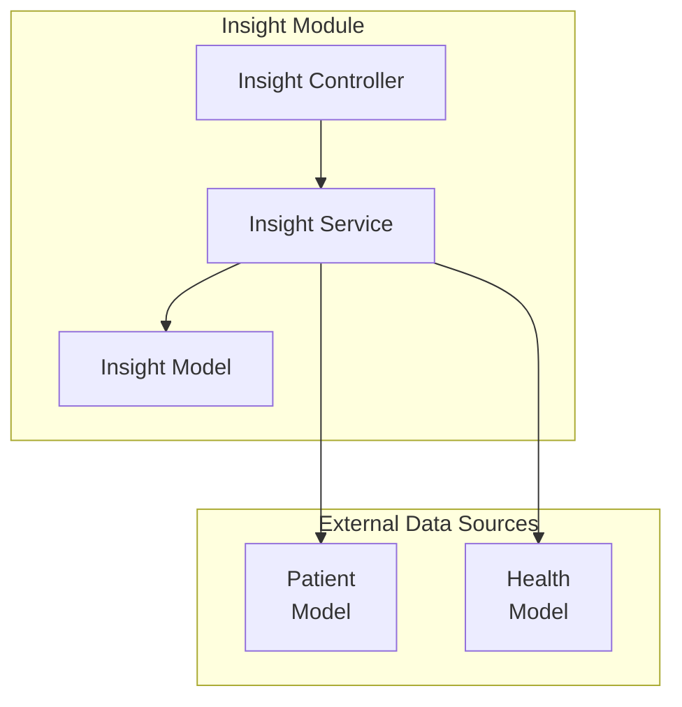
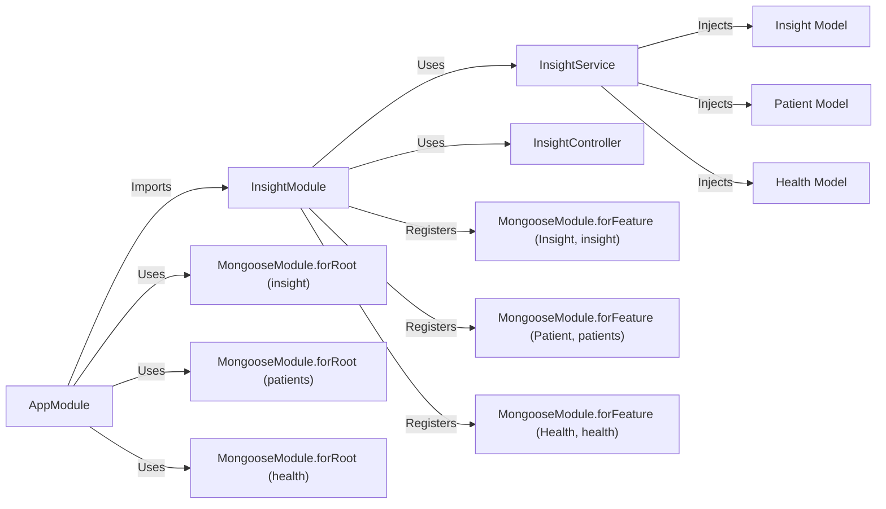

# Aggregating Data from Multiple Databases in a NestJS Insight Service
When developing an insight service in NestJS that requires aggregating data from multiple databases, it is crucial to understand how to effectively manage connections to different MongoDB databases and perform operations across them.

## Scenario: Aggregating Health Insights



## Component Interaction Diagram


## Configuring the App Module

The `AppModule` uses MongooseModule.forRootAsync to asynchronously configure and establish connections to three different MongoDB databases: insight, patients, and health
```typescript
// src/app.module.ts
import { Module } from '@nestjs/common';
import { ConfigModule, ConfigService } from '@nestjs/config';
import { MongooseModule } from '@nestjs/mongoose';
import { InsightModule } from './insight/insight.module';
import databaseConfig from './config/database.config';

@Module({
    imports: [
        ConfigModule.forRoot({
            load: [databaseConfig],
        }),
        MongooseModule.forRootAsync({
            imports: [ConfigModule],
            useFactory: (configService: ConfigService) => ({
                uri: configService.get<string>('database.insight.uri'),
                connectionName: 'insight',
            }),
            inject: [ConfigService],
        }),
        MongooseModule.forRootAsync({
            imports: [ConfigModule],
            useFactory: (configService: ConfigService) => ({
                uri: configService.get<string>('database.patients.uri'),
                connectionName: 'patients',
            }),
            inject: [ConfigService],
        }),
        MongooseModule.forRootAsync({
            imports: [ConfigModule],
            useFactory: (configService: ConfigService) => ({
                uri: configService.get<string>('database.health.uri'),
                connectionName: 'health',
            }),
            inject: [ConfigService],
        }),
        InsightModule,
    ],
})
export class AppModule {}

```
- MongooseModule.forRootAsync is used to asynchronously configure the connection to MongoDB. This is done for each of the three databases (insight, patients, and health).
- useFactory: This is a factory function that retrieves the database URI from the configuration service (ConfigService).

Please note that you shouldn't have multiple connections without a name, or with the same name, otherwise they will get overridden.

## Implementing the Insight Service

The InsightService class is implemented to perform operations across the different MongoDB databases. The service class is injected
```typescript
// src/insight/insight.service.ts
import { Injectable } from '@nestjs/common';
import { InjectModel } from '@nestjs/mongoose';
import { Model } from 'mongoose';
import { Insight, InsightDocument } from './schemas/insight.schema';
import { Patient, PatientDocument } from './schemas/patient.schema';
import { Health, HealthDocument } from './schemas/health.schema';

@Injectable()
export class InsightService {
  constructor(
    @InjectModel(Insight.name, 'insight')
    private insightModel: Model<InsightDocument>,

    @InjectModel(Patient.name, 'patients')
    private patientModel: Model<PatientDocument>,

    @InjectModel(Health.name, 'health')
    private healthModel: Model<HealthDocument>,
  ) {}

  async create(data: string): Promise<Insight> {
    const newInsight = new this.insightModel({ data, timestamp: new Date() });
    return newInsight.save();
  }

  async findAll(): Promise<Insight[]> {
    return this.insightModel.find().exec();
  }

  async countPatientsGreater40WithObesity(): Promise<number> {
    const patientsWithObesity = await this.healthModel
      .find({ condition: 'Obesity' })
      .exec();
    const patientIdsWithObesity = patientsWithObesity.map((patient) => patient.patientId);

    const count = await this.patientModel
      .countDocuments({
        patientId: { $in: patientIdsWithObesity },
        age: { $gt: 40 },
      })
      .exec();

    return count;
  }

  async averageHealthScoreOfObesePatients(): Promise<number> {
    const patientsWithObesity = await this.healthModel
      .find({ condition: 'Obesity' })
      .exec();
    const patientIdsWithObesity = patientsWithObesity.map((patient) => patient.patientId);

    const healthScores = await this.healthModel
      .find({ patientId: { $in: patientIdsWithObesity } })
      .exec();

    const totalScore = healthScores.reduce((sum, record) => sum + record.healthScore, 0);
    return totalScore / healthScores.length;
  }
}

```
## Conclusion
By following this guide, you have successfully set up a NestJS service that connects to multiple MongoDB databases using Mongoose. This setup allows you to perform complex data aggregation and insights generation across different collections stored in separate databases
